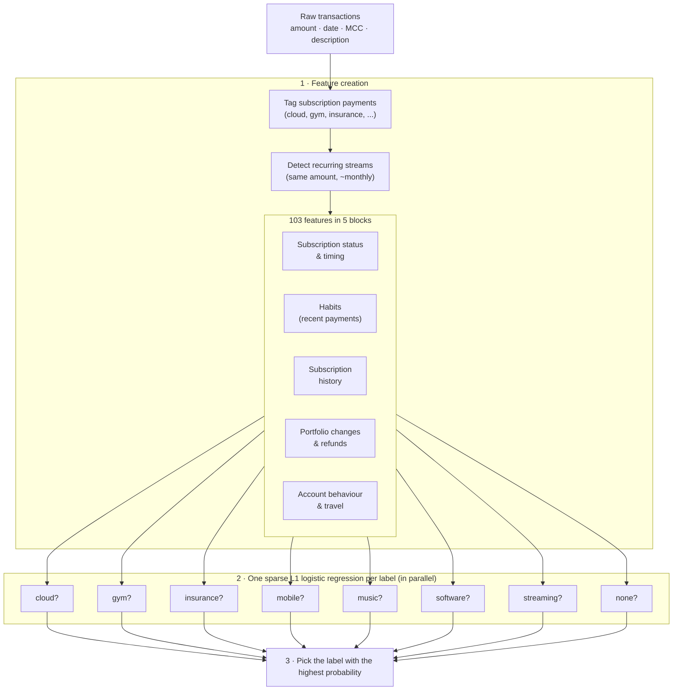

# Next Recurring Merchant Forecast (UBS, Swiss AI Week 2026)

**Task:** for each bank client, predict which subscription family recurs next
in the 90 days after `2026-01-01`:
`cloud, gym, insurance, mobile, music, software, streaming` or `none`.
Metric: macro-F1 over the 8 labels.

**Our idea:** find the right features, keep the model lean, make every
forecast explainable.

## Method at a glance



### 1 · Feature creation
Raw transactions are turned into 103 readable features per client, for example
*"recent gym payments"*, *"is the insurance still running"*, *"which
subscription is due first"*, *"does the client travel"*.

| Feature block | What it captures | Importance* |
|---|---|---|
| Subscription status & timing | still live? overdue? due first? short trial? | 22.5 |
| Habits | recent payments per family (last 90 days) | 13.5 |
| Subscription history | age, number of charges, amount per family | 4.4 |
| Portfolio changes & refunds | families gained or dropped, refunds | 3.6 |
| Account behaviour | payment mix, top-ups, merchant variety, travel | 2.9 |

\*macro-F1 points lost when the block is removed.

### 2 · One L1 logistic regression per label
Each of the 8 labels gets its own yes/no model ("is it gym?"). The L1 (lasso)
penalty keeps only the features that matter for that label, e.g. music uses
23 features and `none` uses 80. Each label picks its own penalty strength by
cross-validation.

### 3 · Decision
The label with the highest probability is the forecast. Because every label
has a short list of coefficients, each prediction can be explained, e.g.
*gym is likely because of recent gym payments (odds ×2.5) and a long-running
gym subscription (×1.8)*.

## Results (macro-F1, validation set)

| Model | Macro-F1 |
|---|---|
| **Our model: sparse L1 logistic regression per label** | **0.513** |
| One global logistic regression | 0.489 |
| Simple rule: "subscription due first" | 0.484 |

Training data: 2,000 labelled clients + 3,152 pseudo-labelled extra clients.
The model is scored on validation clients it has never seen.

## Run it

```bash
pip install -e .                      # Python >= 3.10
unzip data/dataset.zip -d data/
py -3.10 -m src.evaluate "my run"     # score on validation
py -3.10 -m src.make_submission sparse --features lean --pseudo --suffix final
```

## Repository

```
src/          category_map (tagging) · recurrence (streams) · features · model · evaluate · make_submission
data/         challenge data (dataset.zip) + pseudo-labels
extra_info/   experiment log, verified interpretations, coefficients per label
```

Challenge data and task: [Swiss-ai-Weeks/ubs-2026](https://github.com/Swiss-ai-Weeks/ubs-2026) (Apache 2.0).
